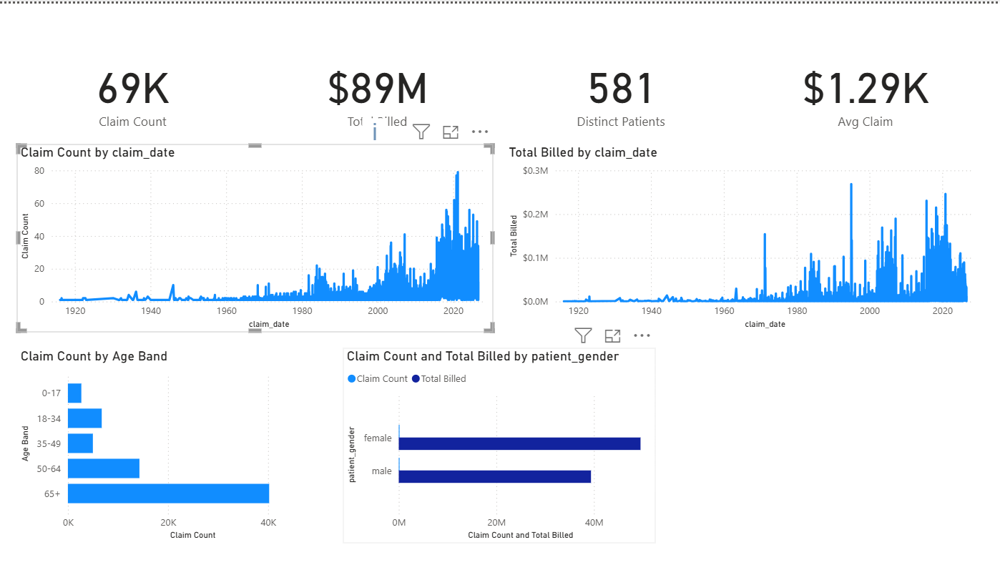
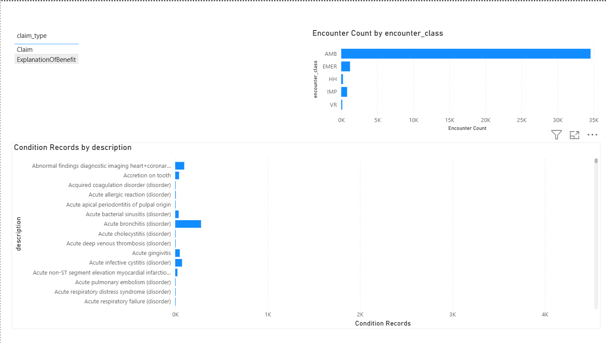

# Healthcare Claims Analytics Pipeline

End-to-end data pipeline and dashboard built on synthetic Medicare/Medicaid-style
claims data — from raw FHIR ingestion through a dbt-modeled star schema to a
Power BI dashboard.

## Problem
Healthcare organizations need reliable, validated claims data to support
utilization reporting, cost analysis, and compliance. This project simulates
that pipeline end-to-end: ingesting realistic FHIR-format healthcare data,
validating and modeling it into a proper analytics warehouse, and surfacing
it in an executive-facing dashboard.

## Architecture
Synthea (synthetic FHIR data)
→ Python (parsing + loading)
→ PostgreSQL (raw staging tables)
→ dbt (staging views → star schema + data quality tests)
→ Power BI (dashboard)

## Tools
Python, pandas, psycopg2, PostgreSQL, dbt-core, dbt tests, Power BI Desktop, DAX, Git/GitHub

## Data
581 synthetic patients generated via [Synthea](https://github.com/synthetichealth/synthea),
producing 37K+ encounters, 21K+ conditions, and 137,924 claim-related records in
FHIR format — fully synthetic, no PHI.

## Star Schema
- `dim_patients` — patient demographics (581 rows)
- `dim_date` — date dimension (2015–2026)
- `fct_claims` — claims fact table joined to both dimensions

## Data Quality Finding
dbt tests surfaced that 50% of `fct_claims` rows had a null `total_amount`.
Root-cause investigation (SQL profiling in pgAdmin) showed this wasn't missing
data — Synthea generates a paired `Claim` and `ExplanationOfBenefit` FHIR
resource for every billing event, 1:1. Only the `Claim` resource carries a
dollar amount; the `ExplanationOfBenefit` copy is a mirror record. This means
`COUNT(*)` and `AVG(total_amount)` on the raw fact table are misleading unless
scoped to `claim_type = 'Claim'` — the dbt test was updated to reflect this,
and the dashboard filters on the same basis.

## Dashboard

## What I'd improve with more time
- Incremental loading instead of full reload on each run
- CI pipeline to run `dbt test` automatically on every push
- Additional dimension tables (providers, diagnosis codes) for deeper drill-down
- A "recent claims only" toggle, since patient histories span back to 1916